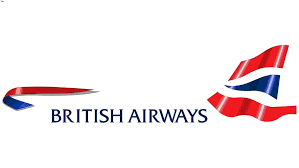

# British Airways Customer Review Analysis

The national airline of the United Kingdom is British Airways (BA). 
Numerous BA planes bring passengers all around the world on their daily 
arrivals and departures from the UK. The aim of this project is to explore
the experience of British Airways customers in order to improve customer service.

# About the dataset

The dataset used was scraped from the web using a website called [Skytrax](https://www.airlinequality.com/airline-reviews/british-airways/).
Skytrax is an independent air travel review website which has become a leading review site for airline,
airport and associated air travel traveller reviews. This is current day data as at the day of scraping.
After obtaining the dataset, the data had to be cleaned and prepped. EDA was performed on it to uncover some insights.

- review_rating: Overall customer review rating of a customer.
- review_title: The title of the review comment or post on the website.
- username_loc_date : The username, their location and date of posting.
- verified: Info of the review being verified or not.
- review_text: The review comment of a customer.
- aircraft: Type of aircraft flown.
- traveller_type: Type of travel.
- seat_type: Classes of the flight (Economy, Premium Economy, Business, First)
- route: Flight source to destination.
- date_flown: Date of flight/trip.

Link to ML app: [link](https://sentalyzer-app.onrender.com/gradio/)

